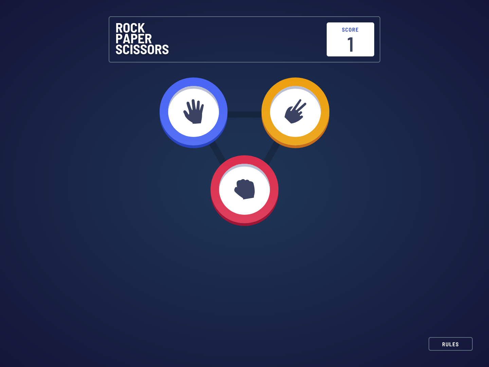
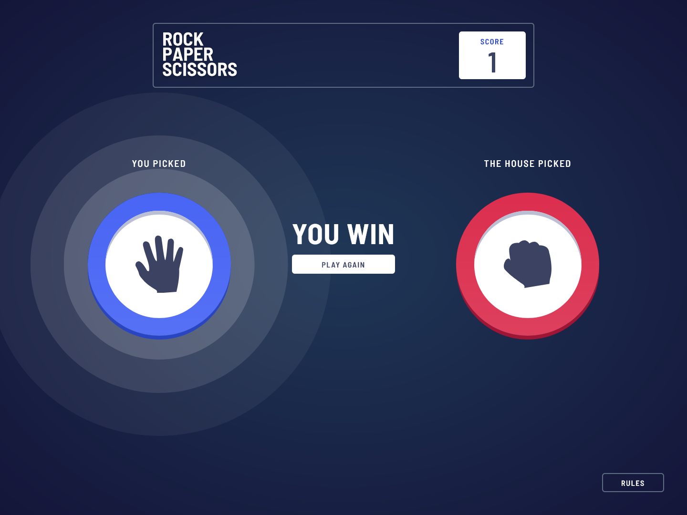
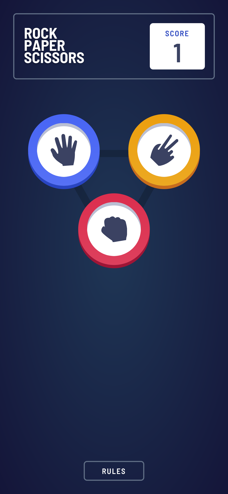
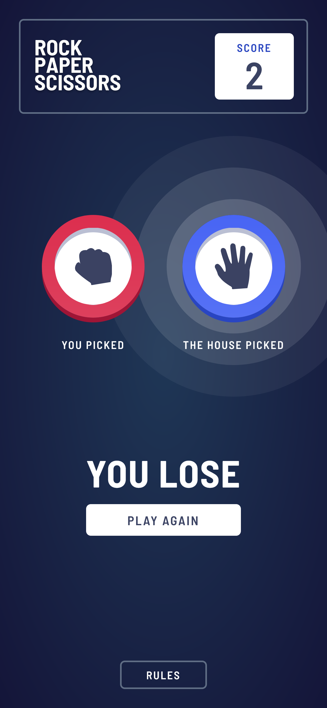
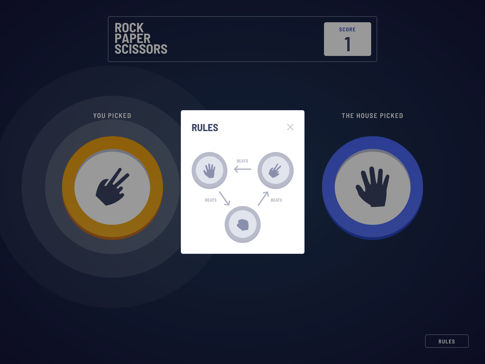
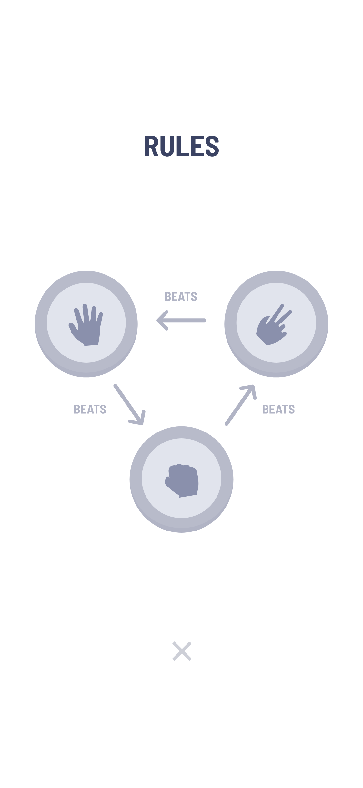

# Frontend Mentor - Rock, Paper, Scissors solution

This is a solution to the [Rock, Paper, Scissors challenge on Frontend Mentor](https://www.frontendmentor.io/challenges/rock-paper-scissors-game-pTgwgvgH). Frontend Mentor challenges help you improve your coding skills by building realistic projects.

## Table of contents

- [Overview](#overview)
  - [The challenge](#the-challenge)
  - [Screenshot](#screenshot)
  - [Links](#links)
- [My process](#my-process)
  - [Built with](#built-with)
  - [What I learned](#what-i-learned)
  - [Continued development](#continued-development)
  - [Useful resources](#useful-resources)
- [Author](#author)
- [Acknowledgments](#acknowledgments)

**Note: Delete this note and update the table of contents based on what sections you keep.**

## Overview

### The challenge

Users should be able to:

- View the optimal layout for the game depending on their device's screen size
- Play Rock, Paper, Scissors against the computer

### Screenshot

### Links

- Solution URL: [source code](https://github.com/br14nn/rock-paper-scissors)
- Live Site URL: [website](https://bvv-rock-paper-scissors-six.vercel.app/)

## My process

### Built with

- Flexbox
- Mobile-first workflow
- [Next.js](https://nextjs.org/) - React framework
- [TailwindCSS](https://tailwindcss.com/) - For styles
- [Zustand](https://zustand-demo.pmnd.rs/) - State management
- [Framer-Motion](https://www.framer.com/motion/) - For animations

## Author

- Frontend Mentor - [@br14nn](https://www.frontendmentor.io/profile/br14nn)
- Github - [@br14nn](https://github.com/br14nn)
- X - [@\_bri\_\_bri\_\_\_](https://x.com/_bri__bri___)

## Acknowledgments

Thank you for all the creator of libraries that helped me to accomplish this project.
